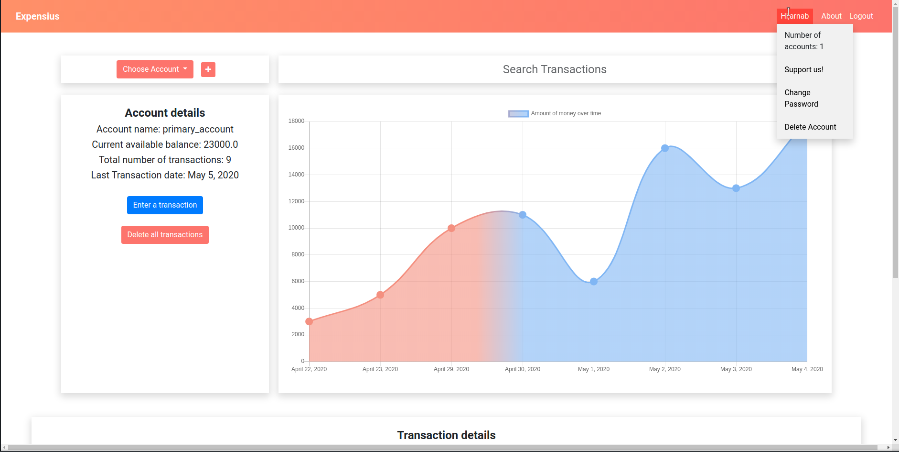
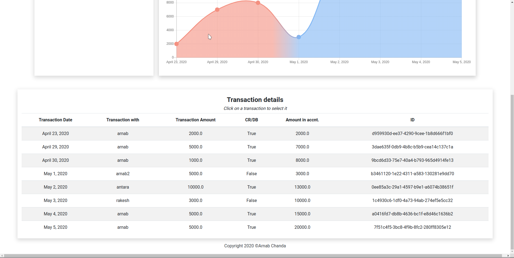
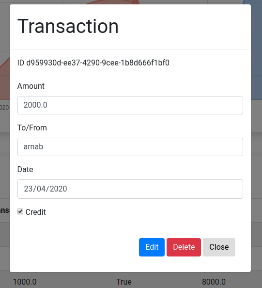
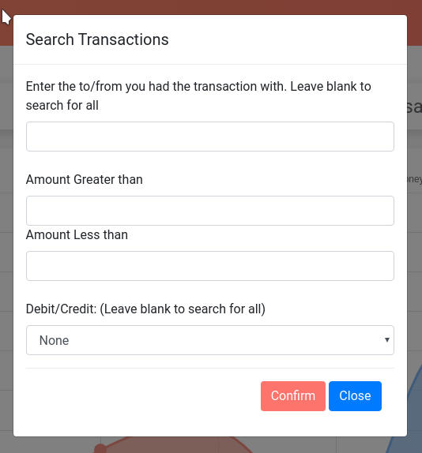

# Expensius

Expensius is a platform to keep a track of your expenses and figure out why your pockets are running dry at the end of the month. Anyways I wanted a system that would let me keep track of expenses and I know that there are existing platforms on the market, yet I thought that a workable project that implements the idea of keeping track of temporal data would involve a bit of database manipulation and hence I thought I'll work on this project. And I did. I kind off made a very basic workable structure few months back but then I decided I would add more complicated logic and features. So let me just tell what we can do with the website.

#### So tell me what the heck is this? And how does it work?

Well, think of expensius like a book where you note down all your expenses only in this case your method is more easier to manage and the you expenses become searcheable.

First you can create an account (Not the same as profile. Think of it like a book where you note down your transactions. A **single profile** can have **multiple accounts**) and deposit the initial money to it. You can add your daily transactons in the account.

You dashboard will look something like this: 

Your transactions will be listed like this:

You can **add**, **delete** and **edit** transactions as long as _they dont make the aldready existing transactions in your account invalid._ 

The edit/delete dialog looks something like this:

You can also search your transactions based on the following criteria:
* Transaction amount
* Person you did the transaction with
* credit/debit

The serach dialog looks somewhat like this:

#### Tech Stack:

* Django
* Postgres
* ChartJs
* Js (vanilla+JQuery), html, css (I used a bit of bootstrap frame work as well)

The website has been hosted on Heroku on the free tier. Sometimes I got some wierd issues when Chart.js was not acting properly. A simple refresh fixes such issues. I have tried to optimise the website for mobile devices and tried to make as responsive as possible using the limited css knowledge that I have. In case you find any bugs, feel free to contact me on my email - arnabchanda964@gmail.com 

#### Side note:

I liked where I got with this project with the little time I invested for this. There are several things I wish were better in this project - like a email authentication, forgot password feature. I also wanted to add OAuth from other social media's like Github, Google, facebook, but I skipped over them as these were not much relevant to the proper working of the website. Maybe I'll implement those features someday! 
